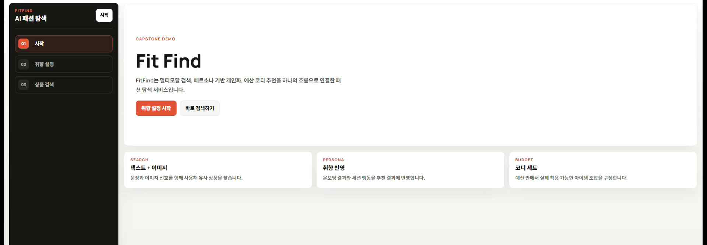
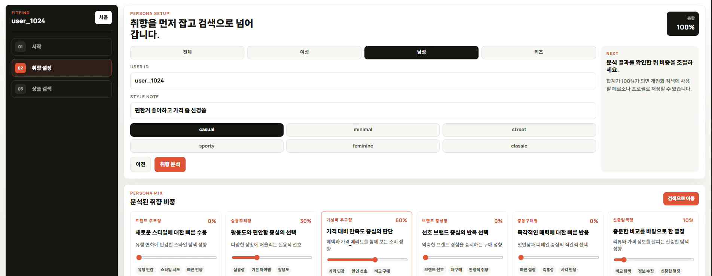
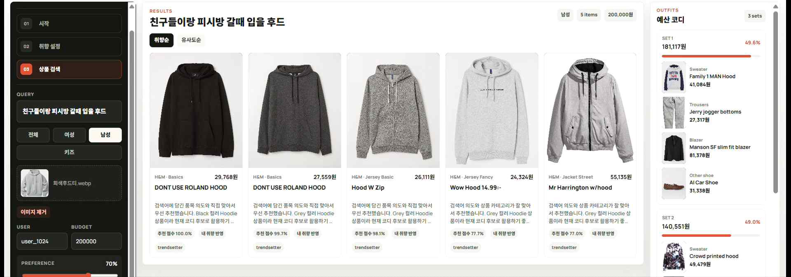

## FitFind - 패션 도메인 Multimodal 검색 & Multi-Stage 추천 시스템



FitFind는 패션 쇼핑에서 **"찾는 것"과 "추천받는 것"을 하나의 흐름으로 연결한** End-to-End 서비스입니다.

쇼핑몰에서 옷을 찾을 때 흔히 겪는 불편이 있습니다. "친구들이랑 피방 갈 때 입을 후드"처럼 말로 검색하면 엉뚱한 결과가 나오고, 마음에 드는 사진이 있어도 비슷한 옷을 찾기 어려우며, 상의 하나를 골랐을 때 어울리는 전체 코디를 예산에 맞춰 짜주는 기능은 거의 없습니다. FitFind는 이 문제들을 한 번에 해결합니다.

- **말로 하든, 사진으로 하든** — 텍스트·이미지·둘 다를 함께 써서 원하는 상품을 검색합니다.
- **나에게 맞게** — 9가지 쇼핑 성향과 실시간 클릭·장바구니 기록을 반영해 결과를 재정렬합니다.
- **세트로 완성** — 예산을 입력하면 부위가 겹치지 않는 완성형 코디 세트를 자동 구성합니다.
- **이유까지 설명** — 각 추천 상품에 대해 "왜 추천했는지"를 AI가 자연어로 설명합니다.

무신사·지그재그·29CM·H&M 등 기존 패션 서비스는 대부분 텍스트 검색과 협업 필터링 기반 추천을 운영하지만, 다음과 같은 한계가 있습니다. FitFind는 이를 각각 직접 구현으로 해소했습니다.

- **분리된 검색·추천** → 검색과 추천을 단일 사용자 흐름으로 연결한 통합 파이프라인
- **제한된 멀티모달** → 텍스트와 이미지를 동시에 활용하는 CLIP 기반 검색
- **지연된 행동 반영** → 온보딩 페르소나 + 실시간 클릭·구매 이벤트 기반 동적 추천
- **코디 추천 부재** → 예산 제약 안에서 카테고리별 완성형 코디 세트 자동 생성

이처럼 FitFind는 개별 기술의 단순 모음이 아니라, 검색·추천·API·프론트엔드·대시보드를 아우르는 **서비스형 통합 시스템**으로 구현된 것이 핵심 차별점입니다.

> 본 프로젝트는 서강대학교 AI중심대학사업단 산학협력 캡스톤디자인으로 진행되었으며, 인포뱅크 CTO 강진범 멘토의 자문을 받아 2026년 3월부터 6월까지 수행되었습니다.

---

### 팀 소개

팀명: 사나이들  
팀장: 손석범

| 이름 | 담당 |
|------|------|
| 손석범 | 프론트엔드, 평가 대시보드 |
| 오승민 | API Gateway, 인프라 |
| 이준원 | 데이터 파이프라인 |
| 장지원 | 추천 모델 (Two-Tower, Ranking, Re-ranking, MAB) |
| 홍찬근 | 검색 엔진 (CLIP + FAISS) |

---

## 기술 스택

| 영역 | 기술 |
|------|------|
| 검색 | CLIP (`openai/clip-vit-base-patch32`), FAISS HNSW |
| 추천 | Two-Tower, LogReg Ranking, ε-Greedy MAB |
| LLM 연동 | Google Gemini API |
| 서빙 | FastAPI, Redis, Docker Compose |
| 프론트엔드 | React 18, Vite, TypeScript |
| 대시보드 | Streamlit |
| 데이터 | H&M Personalized Fashion Recommendations (Kaggle, 약 105만 고객 / 3150만 거래) |

---

## 주요 기능

| 기능 | 설명 |
|------|------|
| 멀티모달 검색 | 텍스트 + 이미지 동시 검색 (CLIP + FAISS HNSW) |
| 개인화 추천 | Two-Tower 후보 생성 → LogReg 랭킹 → MAB 탐색 |
| 페르소나 온보딩 | 9가지 쇼핑 성향 분류 후 Redis 저장, 추천에 반영 |
| 가중치 슬라이더 | 가격·스타일·트렌드 등 추천 반영 비중을 사용자가 직접 조절 |
| 예산 기반 세트 추천 | 예산 내 겹치는 부위 없는 코디 세트 (상의·하의·아우터·신발·액세서리 등) |
| 추천 이유 생성 | 각 추천 상품에 대해 LLM(Gemini)이 맞춤형 추천 이유를 자연어로 생성 |
| 실시간 세션 반영 | 클릭/장바구니 이벤트 → Redis → 즉시 추천 반영 |
| 평가 대시보드 | 검색 품질 지표, 추천 성능, A/B 테스트 결과 시각화 |

---

## 시연 영상 및 주요 화면 설명

https://github.com/user-attachments/assets/49e09f63-e8f5-40e4-b750-8d23659861bc

**1. 취향 설정** — 자연어 입력과 태그 선택을 분석해 9개 쇼핑 성향에 비율로 매핑하고, 슬라이더로 직접 조정



**2. 검색 및 추천** — 텍스트·이미지 검색 결과를 개인화 재정렬하고, 오른쪽에 예산 기반 코디 세트를 함께 제시



---

## 성능 결과

데이터 분할 기준·고정 random seed·지표 세트·결과 저장 규칙을 문서화한 평가 프로토콜로 재현 가능하게 측정했습니다.

**추천 성능**

| 단계 | 지표 | 결과 | 비고 |
|------|------|------|------|
| 후보 생성 (Candidate Generation) | Recall@300 | **0.6029** | 목표 ≥0.30 |
| 랭킹 (Ranking) | AUC | **0.9605** | 목표 ≥0.70 |
| 최종 추천 | HitRate@50 | **0.4910** | Popularity 대비 +0.086 |
| 최종 추천 | NDCG@50 | **0.1772** | Popularity 대비 +0.108 |
| 최종 추천 | Coverage@50 | **0.2146** | Popularity 대비 +0.199 |

단순 인기 상품 추천(Popularity baseline)과 비교해 적중률·순위 품질·추천 다양성이 모두 개선되었습니다.

**검색 성능 / 응답 속도**

| 지표 | 결과 |
|------|------|
| 검색 MRR | **0.8667** (목표 ≥0.55) |
| 검색 NDCG@10 | **0.8243** (목표 ≥0.50) |
| 평균 검색 응답 시간 | **97.89ms** |
| Top-50 추천 평균 지연 | **125.43ms** |
| Top-50 추천 p95 지연 | **162.23ms** |

추천 응답은 목표였던 200ms 이내를 충족해 실제 서비스 수준의 반응 속도를 확보했습니다.

검색 품질, 추천 성능, A/B 테스트 결과는 Streamlit 대시보드에서 한눈에 확인할 수 있습니다.

**Streamlit 대시보드 영상**

https://github.com/user-attachments/assets/f2d34896-75fa-49e6-8f5d-87fedc72b665

---

## 시스템 아키텍처

```
    User (Browser)
           │
           ▼
┌─────────────────────┐
│   Frontend  :3000   │  React + Vite + TypeScript
└──────────┬──────────┘
           │ HTTP
           ▼
┌─────────────────────────────────────────┐    ┌──────────────────────┐
│           API Gateway  :8000            │    │  Dashboard  :8501    │
│                                         ├───►│  Streamlit           │
│  POST /api/search                       │    │  search metrics      │
│  GET  /api/recommend                    │    │  rec metrics         │
│  POST /api/set-recommend                │    └──────────────────────┘
│  POST /api/onboarding                   │
│  POST /api/events                       ├───►┌──────────────────────┐
└──────────┬───────────────────┬──────────┘    │  Simulator           ├──► Redis
           │                   │               │  event simulation    │
           ▼                   ▼               └──────────────────────┘
┌──────────────────┐  ┌─────────────────────┐
│  Search Engine   │  │  Rec-Models         │
│  :8002           │  │  :8003              │
│                  │  │                     │
│  CLIP + FAISS    │  │  Two-Tower          │
│  HNSW index      │  │  LogReg Ranking     │
│  Text + Image    │  │  Re-ranking         │
│                  │  │  e-Greedy MAB       │
└──────────────────┘  └────────┬────────────┘
                               │
                               ▼
                    ┌──────────────────────┐
                    │  Redis :6379         │
                    │  Feature Store       │
                    │  recent_clicks       │
                    │  session_interest    │
                    │  persona_profile     │
                    └──────────┬───────────┘
                               │
                               ▼
                    ┌──────────────────────┐
                    │  CT Pipeline         │
                    │  monitor + retrain   │
                    └──────────────────────┘
```

| 서비스 | 주소 |
|--------|------|
| 프론트엔드 | http://localhost:3000 |
| API Gateway | http://localhost:8000 |
| Search Engine | http://localhost:8002 |
| Rec-Models | http://localhost:8003 |
| 평가 대시보드 | http://localhost:8501 |

---

## 실행 방법

### 사전 요구사항

- Docker Desktop (Docker Compose 포함)
- RAM 16GB 이상 권장
- [H&M Personalized Fashion Recommendations](https://www.kaggle.com/competitions/h-and-m-personalized-fashion-recommendations/data) 데이터셋 (Kaggle)
- Google AI Studio에서 발급한 Gemini API 키

### 1단계 — 데이터셋 배치

Kaggle에서 다운로드한 파일을 다음 경로에 배치합니다.

```
data/raw/
├── articles.csv
├── customers.csv
└── transactions_train.csv
```

### 2단계 — 환경 변수 설정

`.env.example`을 복사해 `.env`를 생성하고 Gemini API 키를 입력합니다.

```bash
cp .env.example .env
```

### 3단계 — 데이터 파이프라인 실행 (최초 1회)

`dev` 모드로 실행되며 `data/processed/` 아래 전처리 파일 전체를 생성합니다. 소요 시간 약 45~60분.

```bash
docker compose run --rm data-pipeline
```

### 4단계 — 모델 학습 (최초 1회)

학습된 체크포인트는 `data/checkpoints/` 아래에 저장됩니다.

```bash
# Two-Tower 후보 모델
docker compose run --rm rec-models python rec_models/candidate/train_two_tower.py

# Ranking 모델
docker compose run --rm rec-models python rec_models/ranking/train_ranking.py
```

### 5단계 — 전체 서비스 실행

```bash
docker compose up
```
